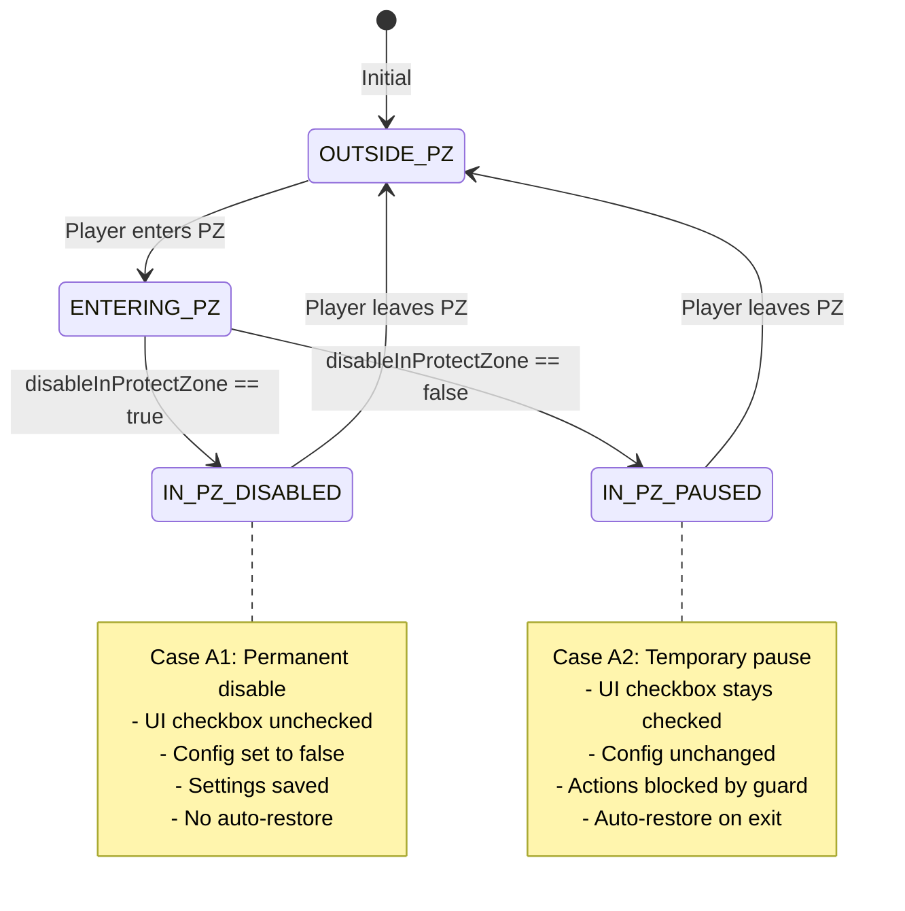

# Auto Target Module Documentation

## Overview

The Auto Target module automatically selects and attacks monsters based on configurable targeting modes. It runs every 250ms via the helper's event system.

## Architecture

```
+------------------+     +-----------------------+     +------------------+
|   helper.otmod   | --> | classes/auto_target.lua | <-- |   helper.lua     |
|  (script loader) |     |  (_Helper.AutoTarget)   |     | (getters/events) |
+------------------+     +-----------------------+     +------------------+
                                   |
                                   v
                         +-------------------+
                         |   helper.otui     |
                         | (UI checkboxes &  |
                         |  mode dropdown)   |
                         +-------------------+
```

## Module Structure

### File: `classes/auto_target.lua`

Contains all auto target logic under the `_Helper.AutoTarget` namespace.

### Exposed Functions

| Function                                           | Description                                  |
| -------------------------------------------------- | -------------------------------------------- |
| `_Helper.AutoTarget.isActive()`                    | Returns if auto target is enabled            |
| `_Helper.AutoTarget.toggle(widget)`                | Toggle auto target on/off                    |
| `_Helper.AutoTarget.updateMode(mode)`              | Change targeting mode (A-J)                  |
| `_Helper.AutoTarget.isValidCreature(creature)`     | Validates if creature can be targeted        |
| `_Helper.AutoTarget.isIgnoredCreature(creature, ignoreTable)` | Checks if creature is in ignore list |
| `_Helper.AutoTarget.check()`                       | Main function - finds and attacks target     |
| `_Helper.AutoTarget.resetCheckbox()`               | Reset UI checkbox to unchecked               |
| `_Helper.AutoTarget.loadToUI()`                    | Load saved state to UI elements              |
| `_Helper.AutoTarget.getModes()`                    | Get all available targeting modes            |
| `_Helper.AutoTarget.getModeId(key)`                | Get mode ID by letter key                    |
| `_Helper.AutoTarget.applyPriorityList()`           | Apply and save priority monster list         |
| `_Helper.AutoTarget.getPriorityMonsterList()`      | Get parsed priority list as ordered array    |

## Targeting Modes

| Mode | ID  | Strategy                                   |
| ---- | --- | ------------------------------------------ |
| A    | 1   | Closest creature                           |
| B    | 2   | Farthest creature                          |
| C    | 3   | Lowest health percentage                   |
| D    | 4   | Highest health percentage                  |
| E    | 5   | Best position (most creatures in AoE area) |
| F    | 6   | Closest + Lowest health (default)          |
| G    | 7   | Closest + Highest health                   |
| H    | 8   | Farthest + Lowest health                   |
| I    | 9   | Farthest + Highest health                  |
| J    | 10  | Priority List (user-defined order)         |

## Mode J: Priority List Targeting

Mode J allows users to define a custom priority list of monster names. The system will:

1. Parse the comma-separated list from `priorityMonsterList`
2. Search for monsters in the area that match names in the list
3. Target the monster with the highest priority (lowest index in list)
4. If same priority, select the closest one
5. If no priority monsters found, fallback to closest target

### Priority List UI

```
+------------------------------------------+
| My Priority List In Order                |
| [dragon, dragon lord, demon    ] [Apply] |
+------------------------------------------+
```

- Only visible when Mode J is selected
- Panel height adjusts dynamically (115px normal, 155px with priority list)
- Apply button disabled until text changes
- Numbers are automatically removed from input

## Execution Flow

```
checkAutoTarget() called every 250ms
         |
         v
+------------------+
| Pre-conditions   |
| check            |
+------------------+
         |
    All passed?
    /        \
  No          Yes
   |           |
   v           v
 Return   +------------------+
          | PZ State Handler |
          | (handlePZState)  |
          +------------------+
                   |
              In PZ?
              /      \
            Yes       No
             |         |
             v         v
          Return   +------------------+
          (blocked)| Check AFK        |
                   | timeout          |
                   +------------------+
                           |
                      AFK timeout?
                      /        \
                    Yes         No
                     |           |
                     v           v
                  Disable   +------------------+
                  & Return  | Check locked     |
                            | target validity  |
                            | (alive, reach,   |
                            |  NOT ignored)    |
                            +------------------+
                                    |
                               Still valid?
                               /        \
                             Yes         No
                              |           |
                              v           v
                           Return   +------------------+
                                    | If ignored:      |
                                    | clear lock &     |
                                    | cancel attack    |
                                    +------------------+
                                            |
                                            v
                                    +------------------+
                                    | Iterate through  |
                                    | spectators       |
                                    +------------------+
                                            |
                                            v
                                    +------------------+
                                    | Calculate best   |
                                    | target for each  |
                                    | mode criteria    |
                                    +------------------+
                                            |
                                            v
                                    +------------------+
                                    | Mode J? Check    |
                                    | priority list    |
                                    +------------------+
                                            |
                                            v
                                    +------------------+
                                    | Select target    |
                                    | based on current |
                                    | mode setting     |
                                    +------------------+
                                            |
                                            v
                                    +------------------+
                                    | Attack target    |
                                    | if different     |
                                    | from current     |
                                    +------------------+
```

## Pre-conditions Check

Before targeting, the module verifies:

1. `helperAutomaticFunctionsEnabled` - Global helper toggle is on
2. `handlePZState()` - PZ state handler (blocks actions in PZ)
3. `autoTargetEnabled` - Auto target specifically is enabled
4. `autoTargetOnHold` - Not paused by magic shooter
5. `g_game.getLocalPlayer()` - Player exists
6. `afkTime` - User is not AFK (action timer check)

## Creature Validation

A creature is valid for auto targeting if:

```lua
function isValidCreature(creature)
  -- Must be a monster (not player/NPC)
  if not creature:isMonster() then return false end

  -- Must not be a summon (masterId == 0 means no owner)
  if creature:getMasterId() ~= 0 then return false end

  -- Must be alive
  if creature:getHealthPercent() <= 0 then return false end

  return true
end
```

## Ignore Monster List

The ignore list is enforced **across ALL targeting modes** as a hard constraint. Ignored monsters will never be selected or attacked.

### Centralized Ignore Check

```lua
-- Centralized function for consistent ignore validation
_Helper.AutoTarget.isIgnoredCreature = function(creature, ignoreTable)
  if not creature then return true end
  local creatureName = creature:getName()
  if not creatureName then return false end
  -- Use provided table or fetch fresh one
  ignoreTable = ignoreTable or (_Helper.getIgnoreMonsterTable and _Helper.getIgnoreMonsterTable() or {})
  return ignoreTable[creatureName:lower()] == true
end
```

### Enforcement Points

The ignore list is validated at **three critical points**:

| Point | Location | Behavior |
|-------|----------|----------|
| **1. Locked target validation** | Before keeping current target | If locked target is ignored, it's dropped |
| **2. Candidate filtering** | During spectator iteration | Ignored creatures excluded from candidate list |
| **3. Real-time editing** | `magic_shooter_panel.lua` | Current attack cancelled if target becomes ignored |

### Ignore Check Flow

```
check() starts
      |
      v
+---------------------------+
| Fetch ignore list once    |
| (single fetch for entire  |
|  check cycle)             |
+---------------------------+
      |
      v
+---------------------------+
| Validate locked target:   |
| - Is alive?               |
| - Is within reach?        |
| - Is NOT ignored? <------ NEW CHECK
+---------------------------+
      |
  All valid?
  /        \
Yes         No
 |           |
 v           v
Return    +---------------------------+
          | If ignored: clear lock &  |
          | cancel attack immediately |
          +---------------------------+
                   |
                   v
          +---------------------------+
          | Filter candidates:        |
          | - isValidCreature()       |
          | - isWithinReach()         |
          | - isSightClear()          |
          | - isIgnoredCreature() <-- |
          +---------------------------+
                   |
                   v
          [Only non-ignored creatures
           proceed to mode selection]
```

### Mode Protection

All targeting modes (A-J) are protected by the ignore list because:

1. The `monsters` table only contains non-ignored creatures
2. All "best target" metrics are calculated from filtered candidates
3. Mode J (Priority List) iterates the same filtered `monsters` table

```
Mode A: Closest         → closest among NON-IGNORED
Mode B: Farthest        → farthest among NON-IGNORED
Mode C: Lowest Health   → lowest health among NON-IGNORED
Mode D: Highest Health  → highest health among NON-IGNORED
Mode E: Best Position   → best AoE position among NON-IGNORED
Mode F: Closest+Low HP  → closest+lowest among NON-IGNORED
Mode G: Closest+High HP → closest+highest among NON-IGNORED
Mode H: Far+Low HP      → farthest+lowest among NON-IGNORED
Mode I: Far+High HP     → farthest+highest among NON-IGNORED
Mode J: Priority List   → priority order among NON-IGNORED
```

### Runtime Behavior

| Scenario | Behavior |
|----------|----------|
| Target becomes ignored during combat | Attack cancelled, new target selected |
| All visible creatures are ignored | No target selected, idle |
| Ignore list edited during gameplay | Current target validated immediately |
| Mode switched while targeting | New mode uses same ignore filter |

### Data Matching Rules

- **Case insensitive**: Names converted to lowercase
- **Whitespace trimmed**: Leading/trailing spaces removed
- **Numbers skipped**: Numeric-only entries ignored
- **Comma-separated**: Format: "dragon, rat, demon"

## Spectators System

The module uses a `spectators` table to track visible monsters:

```
+-------------+     onCreatureAppear     +------------+
|   g_map     | -----------------------> | spectators |
| (game map)  |                          |  (table)   |
+-------------+     onCreatureDisappear  +------------+
                  <-----------------------
                    (300ms debounce)
```

- Creatures are added when they appear on screen
- Removal is debounced by 300ms to handle ID changes
- Initialized on login with `initializeSpectators()`

## Dependencies (Getters in helper.lua)

| Getter                                  | Returns                      |
| --------------------------------------- | ---------------------------- |
| `_Helper.getSpectators()`               | Table of visible monsters    |
| `_Helper.getEnableButtons()`            | UI panel reference           |
| `_Helper.getDistanceBetween(p1, p2)`    | Chebyshev distance           |
| `_Helper.isWithinReach(pos1, pos2)`     | Is within attack range (7x5) |
| `_Helper.countAttackableCreatures(...)` | Creatures in AoE area        |
| `_Helper.getAfkTime()`                  | AFK timeout value            |
| `_Helper.getAutoTargetOnHold()`         | Hold flag state              |
| `_Helper.setAutoTargetOnHold(value)`    | Set hold flag                |
| `_Helper.getShooterProfile()`           | Current shooter profile      |
| `_Helper.getHelperConfig()`             | Main config table            |
| `_Helper.getIgnoreMonsterTable()`       | Table of ignored monsters    |

## UI Integration

### OTUI Callbacks

```lua
-- Checkbox toggle
@onCheckChange: toggleAutoTarget(self)

-- Mode dropdown
@onOptionChange: modules.game_helper.updateAutoTargetMode(self:getCurrentOption().text)

-- Priority list apply
@onClick: applyPriorityMonsterList()
```

### Dynamic Layout Adjustment

When Mode J is selected:
- Priority list widgets become visible
- `enableAutoTarget` anchor changes from `ignoreMonsterInput.bottom` to `priorityMonsterInput.bottom`
- Panel height increases from 115px to 155px

### Shortcut Panel Sync

The module syncs with the shortcut panel via:

```lua
_Helper.Shortcut.syncButton('shortcutAutoTarget', enabled)
```

## Configuration Storage

Settings are stored in `helperConfig`:

```lua
helperConfig = {
  autoTargetEnabled = false,      -- Boolean toggle
  autoTargetMode = 6,             -- Mode ID (default: F)
  currentLockedTargetId = 0,      -- Currently locked target
  ignoreMonsterList = "",         -- Comma-separated ignore list
  priorityMonsterList = "",       -- Comma-separated priority list (Mode J)
  -- ... other settings
}
```

Saved to: `/characterdata/{playerId}/helper.json`

## Event Table Integration

```lua
-- Timer tracking
timers.checkAutoTarget = 0

-- Event configuration
eventTable.checkAutoTarget = {
  interval = 250,  -- Run every 250ms
  action = checkAutoTarget
}

-- Action assignment
eventTable.checkAutoTarget.action = checkAutoTarget
```

## Magic Shooter Interaction

The `autoTargetOnHold` flag prevents auto target from interfering with magic shooter targeting:

- Set to `true` when magic shooter needs exclusive control
- Checked at the start of `checkAutoTarget()`
- Can be reset when user manually toggles auto target on

## Paladin Special Case

For Paladins, a smaller AoE check area is used (diamond arrow area):

```lua
local area = SpellAreas.AREA_CIRCLE3X3
-- Paladin usa AREA_CIRCLE2X2 (diamond arrow area)
if myCharacter:isPaladin() then
  area = SpellAreas.AREA_CIRCLE2X2
end
```

This affects the "Best" targeting mode (E) calculation.

## Protection Zone (PZ) Behavior

The auto target system integrates with the centralized PZ handler (`_Helper.handlePZState`) to manage behavior when entering/leaving Protection Zones.

### PZ State Machine



### Behavior Summary

| Scenario | `disableInProtectZone = true` | `disableInProtectZone = false` |
|----------|------------------------------|-------------------------------|
| Enter PZ | Permanently disable, uncheck UI | Pause (block actions), show message |
| In PZ | Actions blocked | Actions blocked |
| Leave PZ | Stay disabled | Resume automatically, show message |
| Manual toggle in PZ | User can re-enable (not recommended) | User can disable (will not auto-restore) |

### PZ Handler Flow

```
_Helper.handlePZState() called at start of check()
         |
         v
+------------------+
| Get player PZ    |
| status           |
+------------------+
         |
         v
+------------------+
| Edge detection:  |
| wasInPZ vs inPZ  |
+------------------+
         |
    PZ Entry?
    /        \
  Yes         No
   |           |
   v           v
+----------+  PZ Exit?
| Handle   |  /      \
| entry    | Yes      No
+----------+  |        |
              v        v
         +----------+  +----------+
         | Handle   |  | Continue |
         | exit     |  | (guard)  |
         +----------+  +----------+
                              |
                         In PZ?
                         /    \
                       Yes     No
                        |       |
                        v       v
                     Return  Return
                     false   true
```

### State Variables (helper.lua)

```lua
local pzState = {
  wasInPZ = false,                    -- Track previous PZ status for edge detection
  wasAutoTargetEnabled = false,       -- Auto target state before PZ entry
  wasMagicShooterEnabled = false,     -- Magic shooter state before PZ entry
}
```

### Related Functions

| Function | Description |
|----------|-------------|
| `_Helper.handlePZState()` | Main PZ handler, returns false to block actions |
| `_Helper.getPZState()` | Getter for debugging/testing |
| `_Helper.resetPZState()` | Reset on logout/character change |

### Edge Cases Handled

| Edge Case | Behavior |
|-----------|----------|
| Rapid PZ enter/exit | Edge detection prevents duplicate triggers |
| Checkbox changed while in PZ | No effect until next PZ transition |
| Manual disable while in PZ (A2) | Will not auto-restore on exit |
| Client reload in PZ | Starts fresh, blocks actions until PZ exit |
