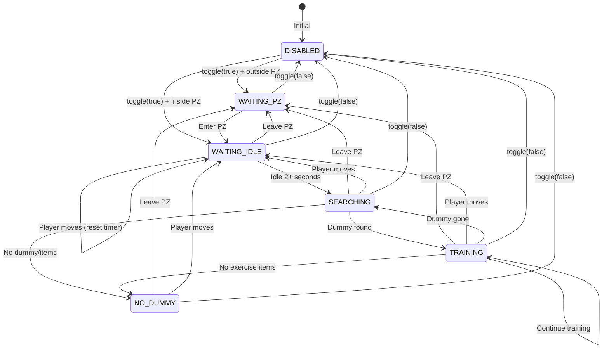
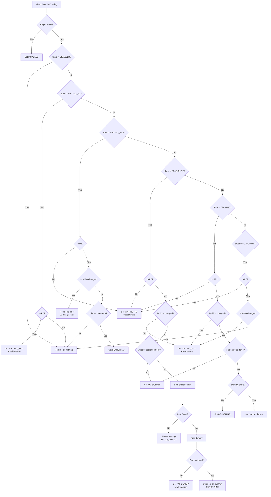

# Exercise Training System Flow

## Overview

The Exercise Training system uses a state-driven approach that automatically selects exercise items from inventory, respects Protection Zone (PZ) rules, and implements position-based retry logic to prevent infinite polling.

## State Machine Diagram



## System Flow Diagram

```
┌─────────────────────────────────────────────────────────────────┐
│                          LOGIN                                  │
│  scheduleEvent(1600ms) → ExerciseTraining.onLogin()             │
│    └─ If enabled in config → toggle(true)                       │
└─────────────────────────────────────────────────────────────────┘
                              │
                              ▼
┌─────────────────────────────────────────────────────────────────┐
│                    CYCLE EVENT (10000ms)                        │
│  checkExerciseTraining():                                       │
│    ├─ Check current state                                       │
│    ├─ Check PZ status                                           │
│    ├─ Check position changes                                    │
│    └─ Execute state-specific logic                              │
└─────────────────────────────────────────────────────────────────┘
                              │
                              ▼
┌─────────────────────────────────────────────────────────────────┐
│                         LOGOUT                                  │
│  ExerciseTraining.onLogout() → stopCycle() + reset state        │
└─────────────────────────────────────────────────────────────────┘
```

## State Descriptions

```
┌─────────────────────────────────────────────────────────────────┐
│  DISABLED                                                       │
│  ─────────────────────────────────────────────────────────────  │
│  • Feature is turned off                                        │
│  • Cycle event is not running                                   │
│  • No actions performed                                         │
├─────────────────────────────────────────────────────────────────┤
│  WAITING_PZ                                                     │
│  ─────────────────────────────────────────────────────────────  │
│  • Feature enabled but player is outside Protection Zone        │
│  • System does nothing (no search, no retry)                    │
│  • Waits for player to enter PZ                                 │
├─────────────────────────────────────────────────────────────────┤
│  WAITING_IDLE                                                   │
│  ─────────────────────────────────────────────────────────────  │
│  • Player is inside PZ                                          │
│  • Waiting for player to stop moving for 2 seconds              │
│  • Movement resets the idle timer                               │
├─────────────────────────────────────────────────────────────────┤
│  SEARCHING                                                      │
│  ─────────────────────────────────────────────────────────────  │
│  • Idle requirement met                                         │
│  • Finding available exercise item from ExerciseIds             │
│  • Searching for nearby ExerciseDummy                           │
├─────────────────────────────────────────────────────────────────┤
│  TRAINING                                                       │
│  ─────────────────────────────────────────────────────────────  │
│  • Dummy found, actively training                               │
│  • Continuously using exercise item on dummy                    │
│  • Monitors for position change, PZ exit, or item depletion     │
├─────────────────────────────────────────────────────────────────┤
│  NO_DUMMY                                                       │
│  ─────────────────────────────────────────────────────────────  │
│  • Search completed but no dummy found at current position      │
│  • Waiting for player to move to a different position           │
│  • NO retries until position changes (prevents spam)            │
└─────────────────────────────────────────────────────────────────┘
```

## Check Function Flow



## Toggle Function Flow

```
toggle(checked)
      │
      ├─ Set helperConfig.exerciseTraining.enabled = checked
      │
      ├─ Sync shortcut panel (if exists)
      │
      └─ checked?
              │
       ┌──────┴──────┐
       │             │
      Yes            No
       │             │
       ▼             ▼
  Player exists?  stopCycle()
       │          setState(DISABLED)
       │          resetTimers()
  ┌────┴────┐
  │         │
 Yes        No
  │         │
  ▼         ▼
In PZ?   setState(DISABLED)
  │
┌─┴─┐
│   │
Yes  No
│   │
▼   ▼
WAITING_IDLE  WAITING_PZ
startCycle()  startCycle()
```

## Automatic Exercise Selection

```
findAvailableExercise()
      │
      ├─ Get player inventory
      │
      └─ For each itemId in ExerciseIds (in order):
              │
              ├─ Check player:getInventoryCount(itemId, 0)
              │
              └─ count > 0?
                      │
               ┌──────┴──────┐
               │             │
              Yes            No
               │             │
               ▼             ▼
         Return itemId   Continue to next
                             │
                             └─ End of list → Return nil
```

## Position-Based Retry Logic

```
┌─────────────────────────────────────────────────────────────────┐
│  PROBLEM: Infinite retry loops when no dummy at position        │
├─────────────────────────────────────────────────────────────────┤
│  SOLUTION: Track lastSearchPosition                             │
│                                                                 │
│  1. When search fails:                                          │
│     └─ Save current position to lastSearchPosition              │
│     └─ Set state to NO_DUMMY                                    │
│                                                                 │
│  2. In NO_DUMMY state:                                          │
│     └─ If position == lastSearchPosition → do nothing           │
│     └─ If position changed → reset to WAITING_IDLE              │
│                                                                 │
│  3. In SEARCHING state:                                         │
│     └─ If position == lastSearchPosition → skip to NO_DUMMY     │
│     └─ If position different → perform search                   │
└─────────────────────────────────────────────────────────────────┘
```

## Key Functions

| Function | Description |
|----------|-------------|
| `toggle(checked)` | Enable/disable Exercise Training, manages cycle and state |
| `startCycle()` | Starts the cycle event (if not already running) |
| `stopCycle()` | Stops and removes the cycle event |
| `check()` | Main logic delegated from legacy eventTable |
| `getState()` | Returns current state (for debugging/UI) |
| `isTraining()` | Returns true if currently in TRAINING state |
| `onLogin()` | Called on game start to restore enabled state |
| `onLogout()` | Called on game end to cleanup |
| `loadToUI()` | Loads saved state to UI checkbox |
| `resetUI()` | Resets UI elements to default |

## Advantages Over Previous System

| Aspect | Old (manual + polling) | New (state-driven) |
|--------|------------------------|-------------------|
| Exercise Selection | Manual by player | Automatic from ExerciseIds |
| PZ Awareness | None | Only operates inside PZ |
| Movement Detection | None | 2-second idle requirement |
| Retry Logic | Infinite retries | Position-based (no spam) |
| State Management | Implicit | Explicit state machine |
| CPU Usage | Constant polling | State-aware checks |
| User Interaction | Required (select item) | Minimal (just enable) |

## Configuration Constants

| Constant | Value | Description |
|----------|-------|-------------|
| `IDLE_REQUIRED_MS` | 2000 | Milliseconds player must be stationary |
| `CHECK_INTERVAL_MS` | 10000 | Cycle event interval |

## Files

- `classes/exercise_training.lua` - Main module with state machine logic
- `tools_panel.lua` - UI toggle and legacy compatibility functions
- `helper.lua` - Contains lifecycle hooks (onLogin, onLogout)
- `styles/tools_panel.otui` - UI definition for checkbox
