# Magic Shooter - Unified Panel Architecture

## Overview

The Magic Shooter system combines spells and runes into a single unified panel with:

- Dynamic rules list (unlimited entries)
- Preset/profile management
- Harmony threshold support for Monk vocation
- Priority determined by list order (top = highest priority)

---

## System Architecture

```mermaid
graph TB
    subgraph "UI Layer"
        MP[magic_shooter_panel.lua] -->|manages| UI[magic_shooter_panel.otui]
        UI --> PRS[Presets Section]
        UI --> FRM[Config Form]
        UI --> LST[Rules List]
        UI --> BTN[Enable Buttons]
    end

    subgraph "Logic Layer"
        MS[classes/magic_shooter.lua] -->|check()| PROC[Process Rules]
        PROC --> SPELL[Cast Spell]
        PROC --> RUNE[Use Rune]
    end

    subgraph "Data Layer"
        CFG[helperConfig] --> PRF[shooterProfiles]
        PRF --> RULES[rules array]
    end

    MP -->|saves/loads| CFG
    MS -->|reads| PRF
```

---

## Data Structure

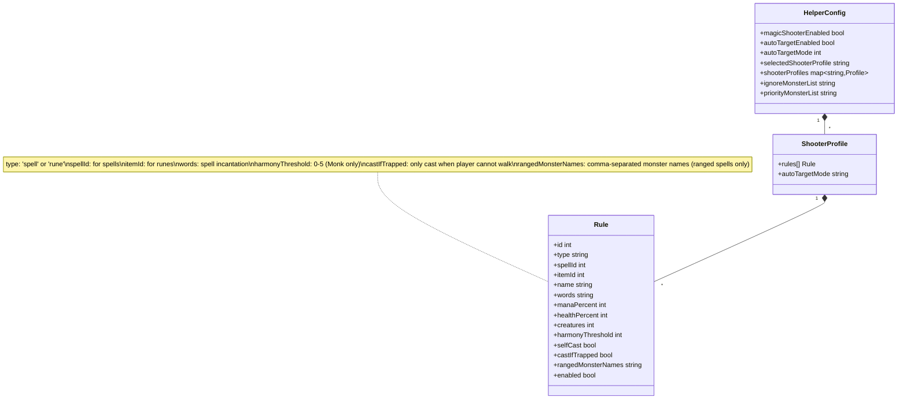

---

## UI Panel Layout

```
+------------------------------------------+
|          Magic Shooter Helper            |
+------------------------------------------+
| Presets: [Default v] [Set Key] [?]       |
|          [Remove] [Rename] [New Preset]  |
+------------------------------------------+
| Select: [Spell][Rune]  Spell Name [Clear]|
+------------------------------------------+
| Creatures  Mana %    Harmony             |  <- Labels Row
| [1+ v]   [-80%+]   [-0+]                 |  <- Controls Row
+------------------------------------------+
| Ranged Monster Names:                    |
| [minotaur archer, minotaur mage   ]      |  <- Only for ranged spells
+------------------------------------------+
| Rules:              [_] Cast If Trapped [Add]  |
| +--------------------------------------+ |
| |[S][icon] exori gran  M:80% C:1+ [v][x]| |  <- Shows words
| |[S][icon] exori mas   M:80% C:2+ T [v][x]| |  <- T = trapped
| |[R][icon] SD Rune     C:1+       [v][x]| |
| +--------------------------------------+ |
+------------------------------------------+
| Ignore Monster List                      |
| [rat, bug, snake...            ] [Apply] |
+------------------------------------------+
| My Priority List In Order                |  <- Only visible when
| [dragon, dragon lord, demon    ] [Apply] |     Mode J is selected
+------------------------------------------+
| [ ] Auto Target [A v] [?]       [Set Key]|
| [ ] Enable Shooter              [Set Key]|
| [    Set Key (Target/Shooter)          ] |
+------------------------------------------+
```

### UI Elements

| Element               | Description                                                                |
| --------------------- | -------------------------------------------------------------------------- |
| `[S]` / `[R]`         | Type indicator (Spell=blue, Rune=orange)                                   |
| `[icon]`              | Spell icon or rune item                                                    |
| `words`               | Spell incantation (e.g., "exori gran")                                     |
| `M:X%`                | Minimum mana percentage                                                    |
| `HP:X%`               | Minimum health percentage                                                  |
| `C:X+`                | Minimum creatures count (around player for all spell types)                |
| `H:X`                 | Harmony threshold (Monk only, shown if > 0)                                |
| `T`                   | Cast If Trapped indicator (shown when enabled)                             |
| `R`                   | Ranged Monster Names configured (shown when set)                           |
| `[v]`                 | Enable/disable checkbox                                                    |
| `[x]`                 | Remove button                                                              |
| `[_] Cast If Trapped` | Checkbox to only cast when player cannot walk in any direction             |
| Ignore Monster List   | Comma-separated list of monsters to ignore when targeting                  |
| Priority List         | Comma-separated ordered list for Mode J targeting (highest priority first) |
| Ranged Monster Names  | Only for ranged spells (237, 238, 280) - filters creatures by name         |

---

## Rule Processing Flow

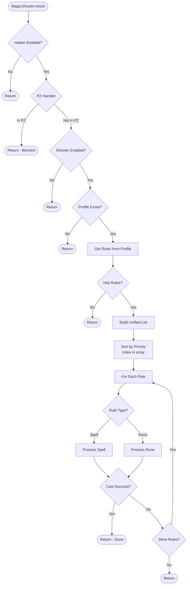

---

## Spell Processing

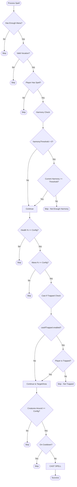

### Creatures Threshold Behavior

The creatures threshold now works consistently for **all spell types**:

| Spell Type        | Creatures Check     | Behavior                             |
| ----------------- | ------------------- | ------------------------------------ |
| Area spells       | Count in area       | Cast when X+ creatures in spell area |
| Targetable spells | Count around player | Cast when X+ creatures around player |
| Support spells    | Count around player | Cast when X+ creatures around player |
| Self-cast spells  | Count around player | Cast when X+ creatures around player |

**Note:** The creatures dropdown is always enabled for all spell types, allowing users to configure when spells should be cast based on how many creatures are nearby.

---

## Harmony System (Monk Only)

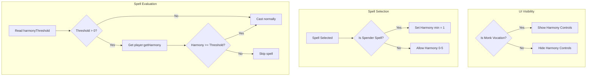

### Spender Spells

Spender spells are Monk-specific spells that consume Harmony points. These spells have a **minimum Harmony threshold of 1** (cannot be set to 0):

| Spell Name           | Words              | Type    |
| -------------------- | ------------------ | ------- |
| Tiger Clash          | exori infir nia    | Spender |
| Greater Tiger Clash  | exori nia          | Spender |
| Devastating Knockout | exori gran nia     | Spender |
| Sweeping Takedown    | exori mas nia      | Spender |
| Spiritual Outburst   | exori gran mas nia | Spender |

When a Monk selects a spender spell:

- The Harmony input is automatically set to "1"
- Trying to set Harmony to "0" will automatically change it to "1"
- Values 1-5 are allowed (max 5)

### Harmony Configuration Examples

| Spell        | Harmony Threshold | Behavior                       |
| ------------ | ----------------- | ------------------------------ |
| Basic Attack | 0                 | Always cast (non-spender only) |
| Tiger Clash  | 1 (min)           | Cast with 1+ Harmony           |
| Medium Spell | 3                 | Only cast with 3+ Harmony      |
| Strong Spell | 5                 | Only cast at max Harmony       |

---

## Panel Functions (magic_shooter_panel.lua)

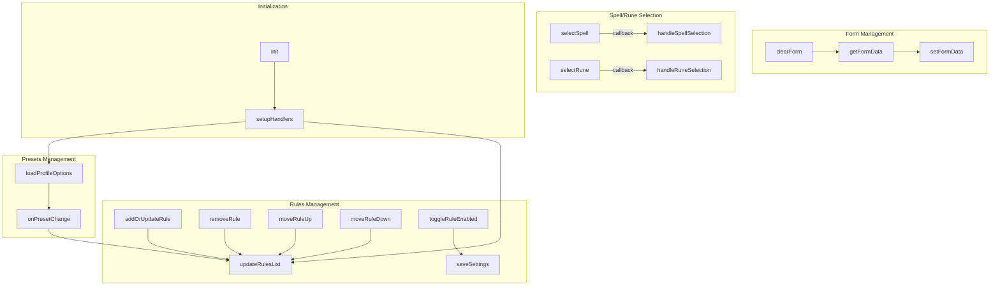

---

## Event Handlers

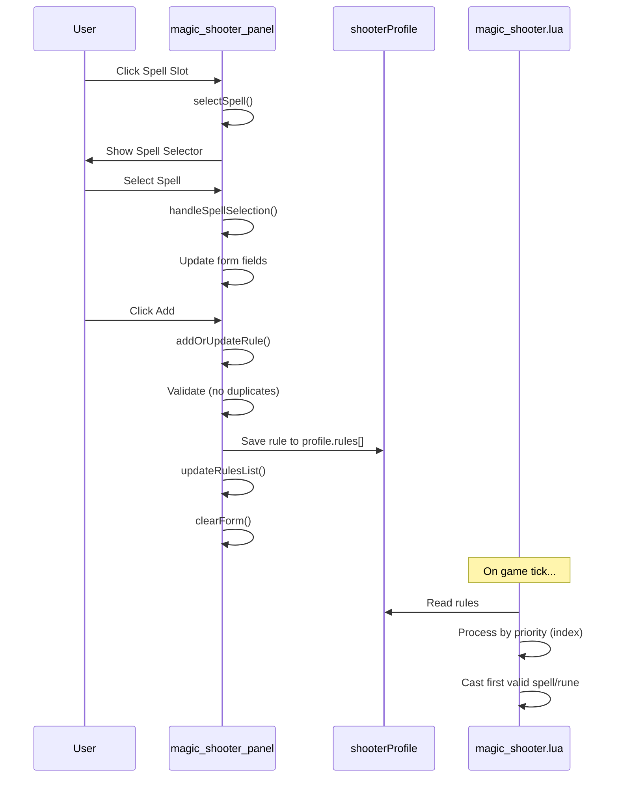

---

## Duplicate Prevention

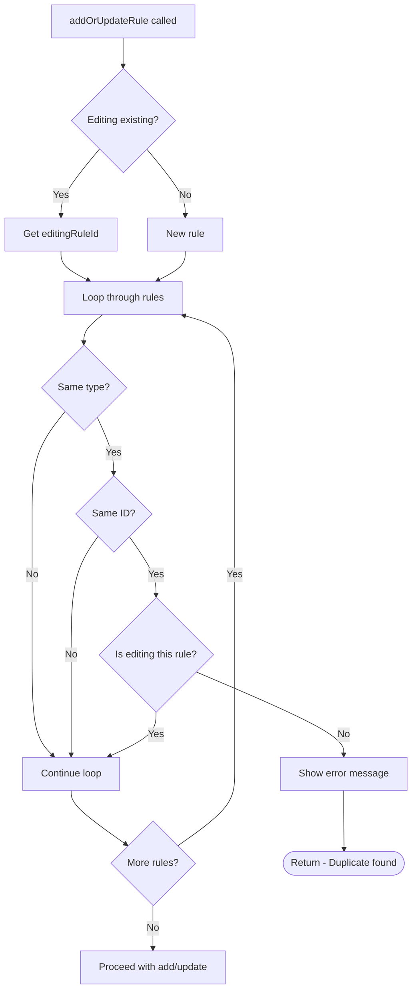

---

## Selection Highlight

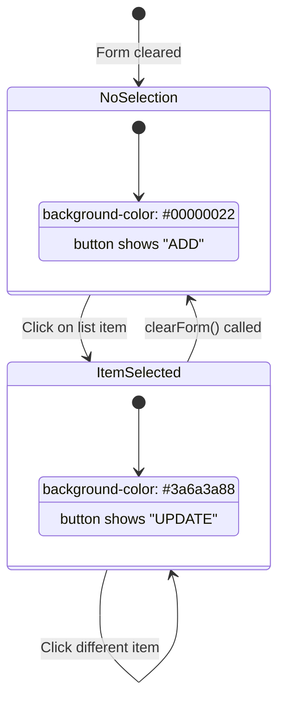

---

## Delete Confirmation

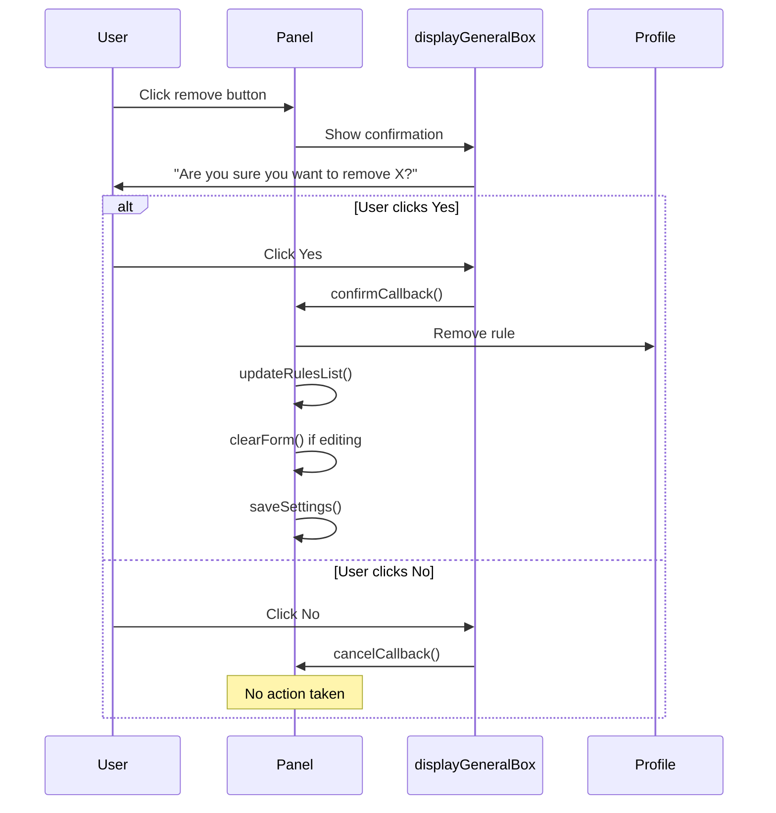

---

## Module Dependencies

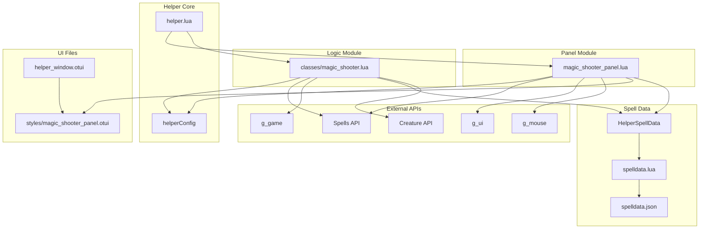

---

## Files Structure

| File                              | Purpose                                                   |
| --------------------------------- | --------------------------------------------------------- |
| `magic_shooter_panel.lua`         | UI panel logic, form handling, rules list                 |
| `styles/magic_shooter_panel.otui` | OTUI layout definitions                                   |
| `classes/magic_shooter.lua`       | Core logic, spell/rune casting                            |
| `helper.lua`                      | Integration, event binding                                |
| `helper_window.otui`              | Main window with ShooterPanel                             |
| `spelldata.json`                  | Spell configuration data (rangedMonsterSpells, etc.)      |
| `spelldata.lua`                   | HelperSpellData module for loading/accessing spell config |
| `../gamelib/creature.lua`         | Creature class with hasIcon() method                      |

---

## Key Features Summary

1. **Unified List**: Spells and runes in same list, ordered by priority
2. **Dynamic Rules**: Add/remove unlimited rules
3. **Presets**: Multiple profiles with hotkey support
4. **Harmony Support**: Threshold configuration for Monk spells
5. **Visual Feedback**: Selected item highlighting, words display
6. **Duplicate Prevention**: Cannot add same spell/rune twice
7. **Confirmation Dialog**: Safe deletion with Yes/No prompt
8. **Context Menu**: Right-click for Edit/Move Up/Move Down/Delete
9. **Ignore Monster List**: Exclude specific monsters from auto targeting
10. **Priority Monster List**: Mode J allows user-defined targeting priority order
11. **Cast If Trapped**: Only cast spell/rune when player cannot walk in any cardinal direction
12. **Creatures Threshold for All Spells**: Creatures dropdown enabled for all spell types (area, targetable, support) - counts creatures around player
13. **Ranged Monster Spells**: Filter creatures by name for specific spells (exana amp res, exeta amp res, exori mas res) with auto-direction for exori mas res
14. **Turned Melee Icon Filter**: Automatically excludes creatures that already have the turned_melee icon (icon 3) from ranged spell creature counting
15. **Summon Filter**: Automatically excludes summoned creatures (creatures with a master) from targeting - same logic as Auto Target

---

## Monster List Features

### Ignore Monster List

Monsters in this list will be excluded from auto targeting:

```
+------------------------------------------+
| Ignore Monster List                      |
| [rat, bug, snake              ] [Apply]  |
+------------------------------------------+
```

- Comma-separated list of monster names (case-insensitive)
- Apply button saves to `helperConfig.ignoreMonsterList`
- Apply button disabled until text changes
- Monsters matching names in list are skipped during targeting

### Priority Monster List (Mode J)

When Auto Target mode "J" is selected, this list defines targeting priority:

```
+------------------------------------------+
| My Priority List In Order                |
| [dragon, dragon lord, demon    ] [Apply] |
+------------------------------------------+
```

- Only visible when Mode J is selected
- Panel height adjusts dynamically (115px → 155px when visible)
- First monster in list has highest priority
- If same priority, closest monster is selected
- If no priority monsters found, falls back to closest target
- Apply button disabled until text changes
- Numbers are automatically removed from input

### Dynamic Layout Adjustment

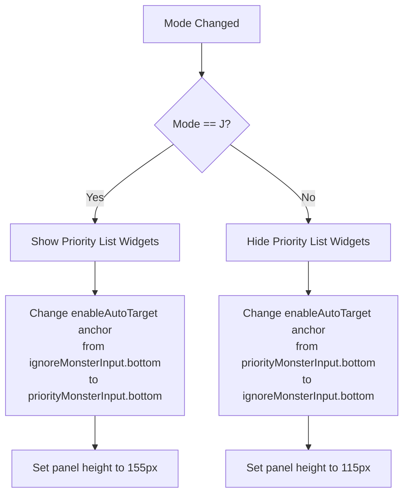

---

## Cast If Trapped Feature

The "Cast If Trapped" feature allows a spell or rune to only be cast when the player is unable to walk in any of the 4 cardinal directions (North, South, East, West).

### Use Cases

- **Emergency spells**: Cast powerful area spells only when surrounded by monsters
- **Defensive runes**: Use area runes when trapped to clear a path
- **Situational attacks**: Reserve specific spells for dangerous trapped situations

### How It Works

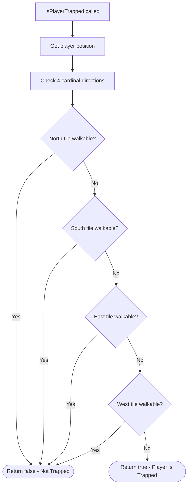

### UI Integration

The checkbox "Cast If Trapped" appears next to the "Add" button in the rules panel:

```
| Rules:              [_] Cast If Trapped [Add]  |
```

- Check the box before clicking Add/Update to enable this restriction
- When a rule has `castIfTrapped` enabled, a "T" indicator appears in the rule summary

### Summary Display

| Indicator | Meaning                                  |
| --------- | ---------------------------------------- |
| `T`       | Cast If Trapped is enabled for this rule |

Example rule summary: `C:2+ MP:80% HP:100% T` (Creatures 2+, Mana 80%+, Health 100%+, Trapped only)

---

## Ranged Monster Spells Feature

The "Ranged Monster Names" feature allows specific spells to filter creatures by name and automatically turn the player toward the direction with most matching creatures.

### Supported Spells

| Spell ID | Spell Name           | Words         | Auto Direction |
| -------- | -------------------- | ------------- | -------------- |
| 237      | Chivalrous Challenge | exeta amp res | No             |
| 238      | Divine Dazzle        | exana amp res | No             |
| 280      | Balanced Brawl       | exori mas res | **Yes**        |

### Configuration (spelldata.json)

The list of ranged monster spells is configured in `spelldata.json`:

```json
{
  "rangedMonsterSpells": [237, 238, 280]
}
```

### UI Integration

When one of these spells is selected, a new row appears in the config form:

```
+------------------------------------------+
| Ranged Monster Names: [minotaur archer, minotaur mage   ] |
+------------------------------------------+
```

- **Input field**: Accepts comma-separated monster names (case-insensitive)
- **Placeholder**: Shows "minotaur archer, minotaur mage" as example
- **Panel height**: Expands from 90px to 116px when visible

### How It Works

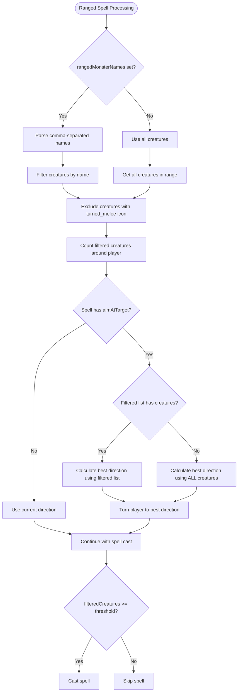

### Turned Melee Icon Filter

Creatures with the `turned_melee` icon (icon ID 3, category 1) are automatically excluded from the creature count. This is because the ranged spells convert creatures to melee for a few seconds, and creatures already converted should not be counted again.

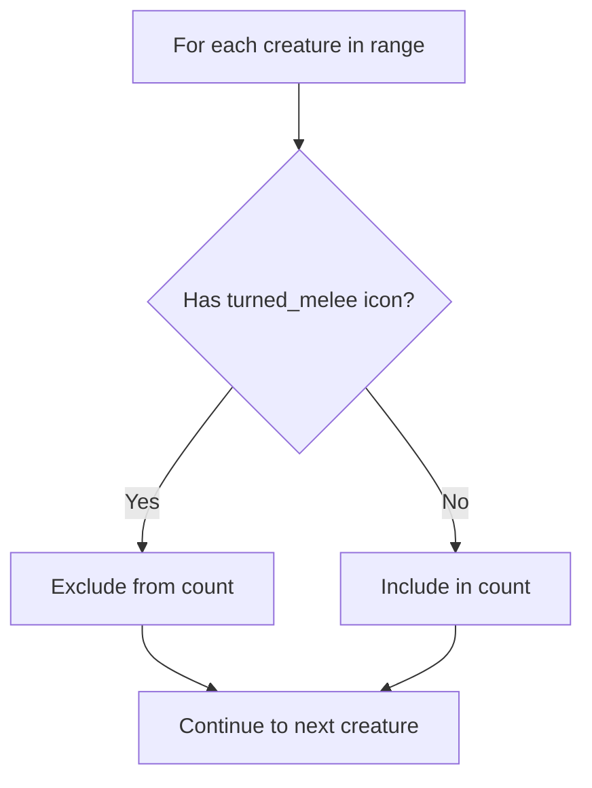

The icon check uses `Creature:hasIcon(iconId, category)` method added to `creature.lua`:

```lua
-- Monster icon constants (category 1)
MonsterIconTurnedMelee = 3

function Creature:hasIcon(iconId, category)
    category = category or 1
    local icons = self:getIcons()
    if not icons then return false end

    for _, iconData in pairs(icons) do
        local id = iconData[1]       -- icon ID
        local cat = iconData[2]      -- category
        if id == iconId and cat == category then
            return true
        end
    end
    return false
end
```

### Direction Calculation (exori mas res only)

Only `exori mas res` (ID 280) has `aimAtTarget = true`, which triggers the direction calculation:

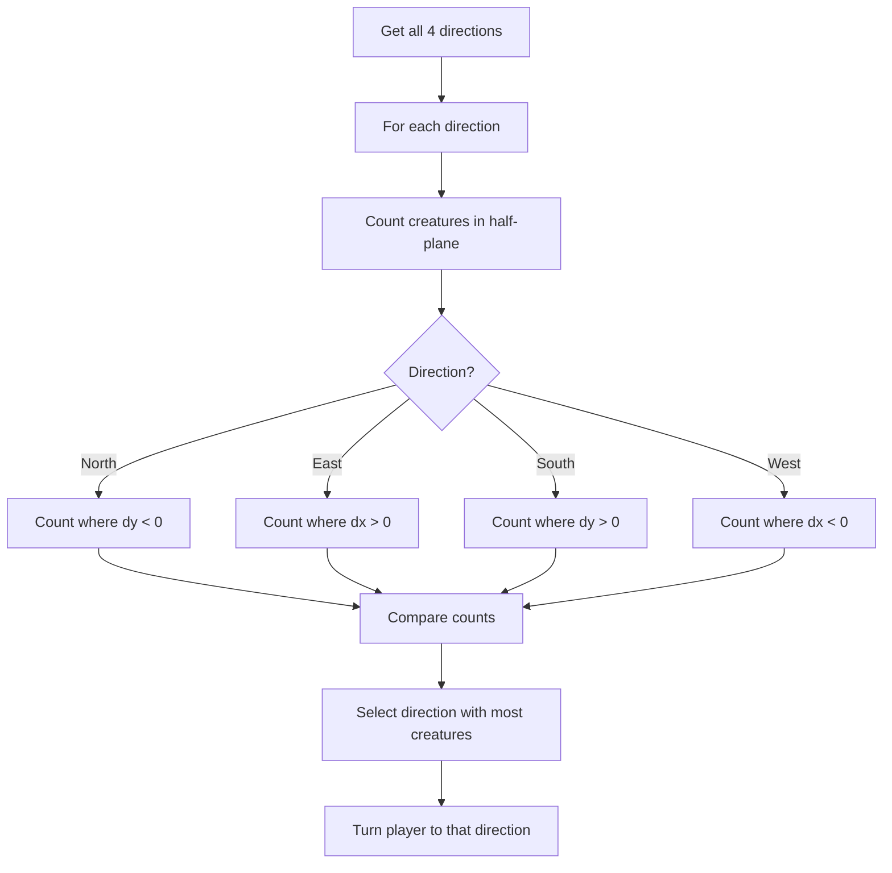

### Summary Display

When a rule has `rangedMonsterNames` configured, an "R" indicator appears in the rule summary:

| Indicator | Meaning                                          |
| --------- | ------------------------------------------------ |
| `R`       | Ranged Monster Names is configured for this rule |

Example rule summary: `C:2+ MP:80% R` (Creatures 2+, Mana 80%+, Ranged filter active)

### Behavior Summary

| Scenario                                          | Creature Filter           | Direction                                  |
| ------------------------------------------------- | ------------------------- | ------------------------------------------ |
| Names set + matching creatures + exori mas res    | Filter by names           | Auto-turn to direction with most from list |
| Names set + NO matching creatures + exori mas res | All creatures (fallback)  | Auto-turn to direction with most creatures |
| Names set + other ranged spells                   | Filter by names           | Keep current direction                     |
| Names empty + exori mas res                       | All creatures (no filter) | Auto-turn to best direction                |
| Names empty + other ranged spells                 | All creatures (no filter) | Keep current direction                     |

**Note:** In all cases, creatures with the `turned_melee` icon are excluded from counting.

**Important:** When `rangedMonsterNames` is configured but no matching creatures are found on screen, the direction calculation falls back to using all creatures (excluding turned_melee). This ensures the player always turns toward the direction with the most monsters, even if none of them match the filter list.

---

## Summon Filter

The Magic Shooter automatically excludes summoned creatures from targeting, matching the behavior of Auto Target.

### How It Works

A creature is considered a summon if it has a master (owner). This is detected using `creature:getMasterId()`:

```lua
-- Ignorar criaturas invocadas (summons) - mesma lógica do Auto Target
if creature:getMasterId() ~= 0 then
  goto continue
end
```

### Detection Logic

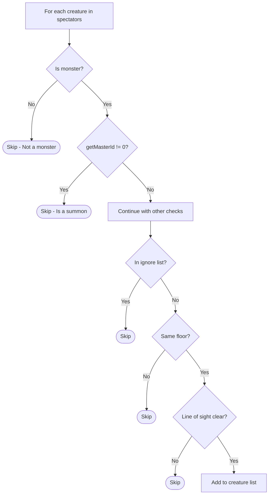

### Consistency with Auto Target

Both systems now use identical logic for summon detection:

| System        | Check                        | Location                  |
| ------------- | ---------------------------- | ------------------------- |
| Auto Target   | `creature:getMasterId() ~= 0` | `isValidCreature()` function |
| Magic Shooter | `creature:getMasterId() ~= 0` | Creature collection loop    |

### Behavior Summary

| Creature Type       | `getMasterId()` | Targeted? |
| ------------------- | --------------- | --------- |
| Regular monster     | 0               | ✅ Yes    |
| Player summon       | Player ID       | ❌ No     |
| Monster summon      | Monster ID      | ❌ No     |

This ensures that:
- Player summons (like fire elemental, demon skeleton) are never targeted
- Monster summons are never targeted
- Only independent monsters are considered valid targets

---

## Protection Zone (PZ) Behavior

The magic shooter system integrates with the centralized PZ handler (`_Helper.handlePZState`) to manage behavior when entering/leaving Protection Zones.

### PZ State Machine

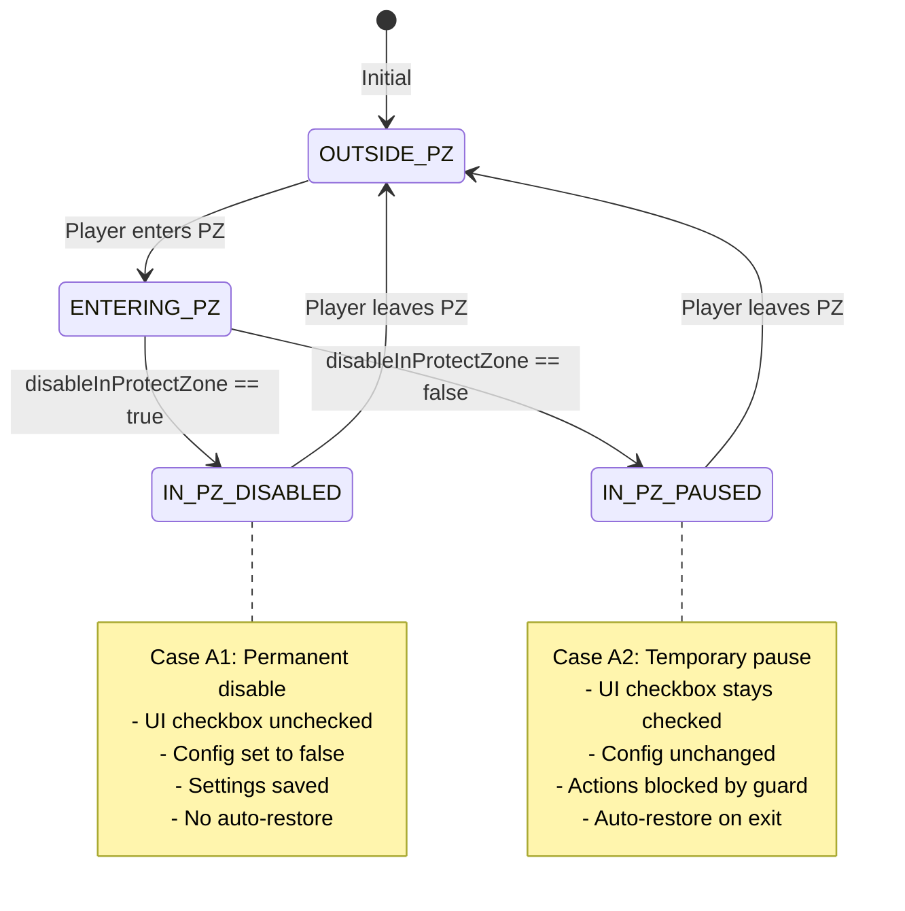

### Behavior Summary

| Scenario            | `disableInProtectZone = true`        | `disableInProtectZone = false`           |
| ------------------- | ------------------------------------ | ---------------------------------------- |
| Enter PZ            | Permanently disable, uncheck UI      | Pause (block actions), show message      |
| In PZ               | Actions blocked                      | Actions blocked                          |
| Leave PZ            | Stay disabled                        | Resume automatically, show message       |
| Manual toggle in PZ | User can re-enable (not recommended) | User can disable (will not auto-restore) |

### PZ Handler Integration

The PZ handler is called at the **beginning** of `_Helper.MagicShooter.check()`, before the enabled check:

```lua
-- PZ Guard: handles state transitions and blocks actions while in PZ
-- Must be called before enabled check to detect PZ exit and restore state
if _Helper.handlePZState then
  local shouldContinue = _Helper.handlePZState()
  if not shouldContinue then
    return
  end
end
```

### Shared State with Auto Target

Both auto_target and magic_shooter share the same PZ state in `helper.lua`:

```lua
local pzState = {
  wasInPZ = false,                    -- Track previous PZ status for edge detection
  wasAutoTargetEnabled = false,       -- Auto target state before PZ entry
  wasMagicShooterEnabled = false,     -- Magic shooter state before PZ entry
}
```

### Related Functions

| Function                  | Description                                     |
| ------------------------- | ----------------------------------------------- |
| `_Helper.handlePZState()` | Main PZ handler, returns false to block actions |
| `_Helper.getPZState()`    | Getter for debugging/testing                    |
| `_Helper.resetPZState()`  | Reset on logout/character change                |

### Edge Cases Handled

| Edge Case                        | Behavior                                   |
| -------------------------------- | ------------------------------------------ |
| Rapid PZ enter/exit              | Edge detection prevents duplicate triggers |
| Checkbox changed while in PZ     | No effect until next PZ transition         |
| Manual disable while in PZ (A2)  | Will not auto-restore on exit              |
| Client reload in PZ              | Starts fresh, blocks actions until PZ exit |
| Both systems enabled at PZ entry | Both are handled together by same handler  |
