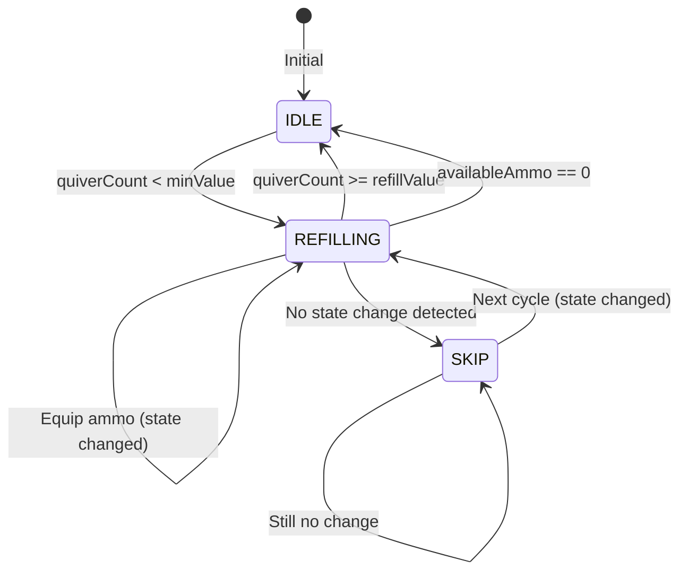

# Quiver Refill System Flow

## Overview

The Quiver Refill system automatically equips ammunition from inventory to the quiver when the quiver count drops below a configured minimum threshold. It uses a state-driven approach with guards to prevent redundant equip attempts.

---

## State Machine



---

## Check Function Flow

```
checkQuiverRefill()
  │
  ├─ Feature enabled? ──────────────────── No ──→ Reset state, return
  │
  ├─ Player exists? ─────────────────────── No ──→ return
  │
  ├─ Ammo item configured (id != 0)? ────── No ──→ return
  │
  ├─ Right slot has item? ───────────────── No ──→ Reset state, return
  │
  ├─ Get quiverCount (container or stack)
  │
  ├─ Get availableAmmo (inventory, excluding quiver)
  │
  ├─ quiverCount < minValue AND not refilling?
  │         │
  │        YES → Start refilling, save tracking state
  │
  ├─ isRefillingQuiver AND quiverCount >= refillValue?
  │         │
  │        YES → Stop refilling, reset state, return
  │
  └─ isRefillingQuiver?
          │
         YES
          │
          ├─ GUARD 1: availableAmmo == 0?
          │         │
          │        YES → Stop refilling (no ammo to move)
          │
          ├─ GUARD 2: quiverCount == lastQuiverCount
          │           AND availableAmmo == lastAvailableAmmo?
          │         │
          │        YES → Skip equip (no change, prevent spam)
          │
          ├─ Update tracking state
          │
          └─ Equip ammunition
```

---

## Redundant Equip Prevention

### Problem (Before Fix)

```
1. Quiver drops below minValue
2. System starts refilling (isRefillingQuiver = true)
3. Equip action is sent
4. Check runs again before equip completes
5. Same equip action is sent again (redundant!)
6. Repeat until quiver reaches refillValue
```

This causes:
- Unnecessary network traffic
- Wasted CPU cycles
- Potential desync issues

### Solution (After Fix)

```
checkQuiverRefill() now tracks:
  │
  ├─ lastQuiverCount: Previous quiver count
  │
  └─ lastAvailableAmmo: Previous available ammo in inventory

Before equipping:
  │
  ├─ Compare current values with last values
  │
  └─ If both are unchanged:
          │
          ├─ Equip is still processing OR
          │
          ├─ No ammo was actually moved
          │
          └─ SKIP this equip cycle
```

---

## Guard Conditions

| Guard | Condition | Action |
|-------|-----------|--------|
| Feature disabled | `!enabled` | Reset all state, return |
| No player | `!player` | Return |
| No ammo configured | `itemId == 0` | Return |
| No quiver equipped | `!rightItem` | Reset state, return |
| Refill complete | `quiverCount >= refillValue` | Stop refilling, return |
| No ammo available | `availableAmmo == 0` | Stop refilling, return |
| No state change | `quiverCount == last && availableAmmo == last` | Skip equip |

---

## State Variables

| Variable | Type | Description |
|----------|------|-------------|
| `isRefillingQuiver` | boolean | Whether refill cycle is active |
| `lastQuiverCount` | number | Quiver count at last equip attempt |
| `lastAvailableAmmo` | number | Available ammo at last equip attempt |

---

## Configuration

| Config Key | Default | Description |
|------------|---------|-------------|
| `quiverRefill.enabled` | false | Feature enabled |
| `quiverRefill.itemId` | 0 | Ammunition item ID |
| `quiverRefill.minValue` | 50 | Start refilling below this |
| `quiverRefill.refillValue` | 100 | Stop refilling at this |

---

## Edge Cases Handled

| Scenario | Behavior |
|----------|----------|
| Quiver partially filled | Refill only if below minValue |
| Quiver full | No action (quiverCount >= refillValue) |
| Inventory has same amount as quiver needs | Equip once, then stop (guard detects no change) |
| Inventory has less than needed | Equip what's available, stop when availableAmmo == 0 |
| Rapid checks without inventory change | Guard prevents repeated equip attempts |
| Equip still processing | Guard skips until state changes |

---

## Files

- `tools_panel.lua` - Main quiver refill logic in `checkQuiverRefill()`
- `styles/tools_panel.otui` - UI definition for paladin panel
